<p align="center">
  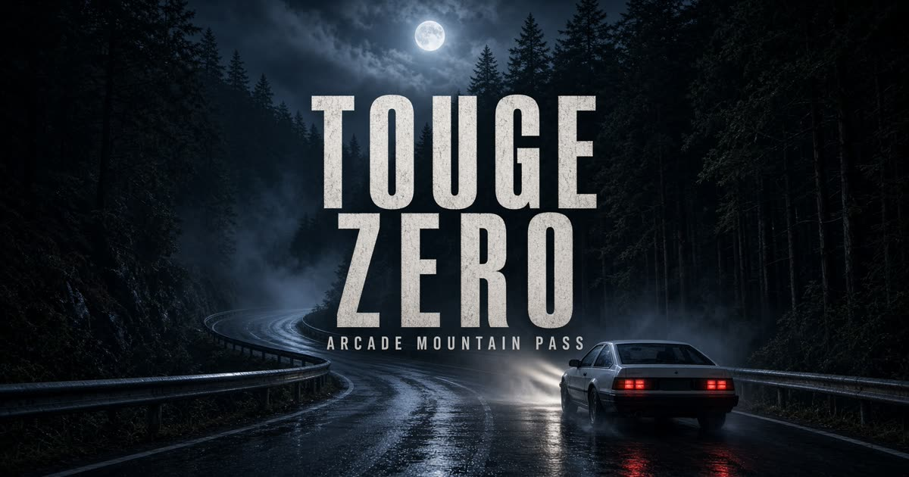
</p>

<h1 align="center">TOUGE ZERO</h1>

<p align="center">
  <b>Arcade mountain-pass racing in the browser.</b><br>
  瀏覽器裡的街機山路競速。
</p>

<p align="center">
  
  
  
  
</p>

<p align="center">
  <a href="#english">English</a> · <a href="#中文">中文</a>
</p>

<p align="center">
  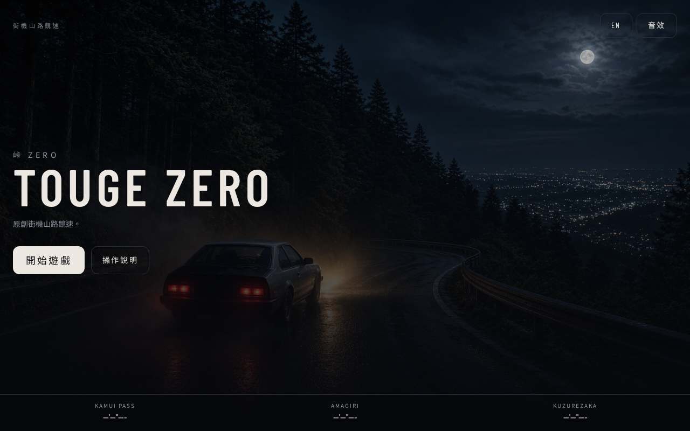
  &nbsp;
  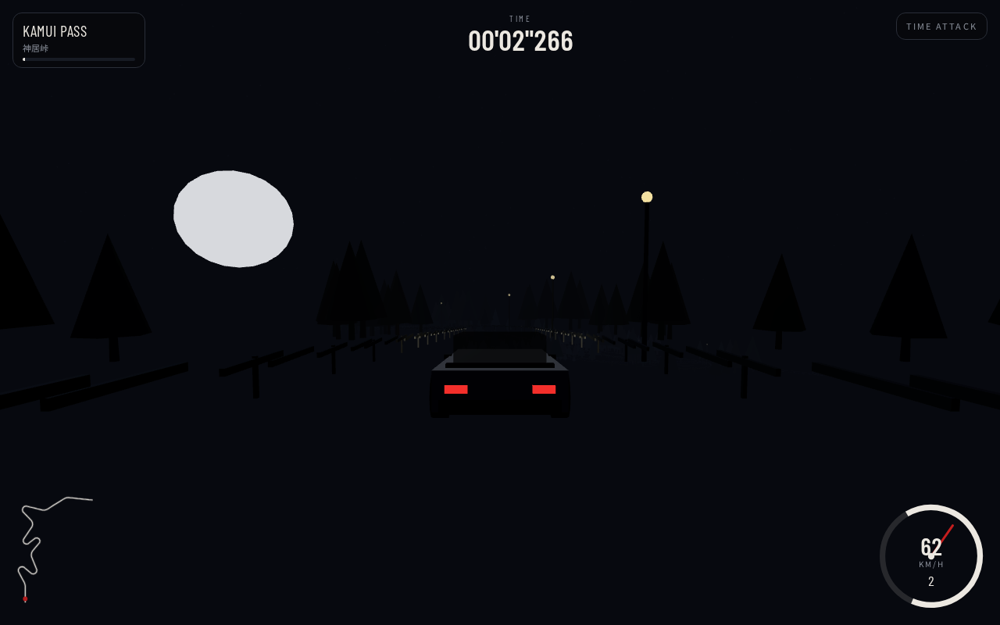
</p>

---

## English

Night. Wet asphalt. Guardrails. A compact FR coupe and a mountain that wants you off the edge.

**TOUGE ZERO** is a downhill time-attack / rival-battle racer inspired by classic Japanese arcade touge games — point-to-point mountain passes, drift through hairpins, chase the car in front of you. It is an original work.

### Play

Open the game, hit **START**, pick a mode, a pass, and a car.

| Mode | What it is |
| --- | --- |
| **Time Attack** | Solo downhill. Beat your best. Times save in the browser. |
| **Battle** | A rival starts ahead. Catch them before the finish line. |

Language toggle on the title screen: **English / 中文**. Keyboard, gamepad, and on-screen touch controls all work.

<p align="center">
  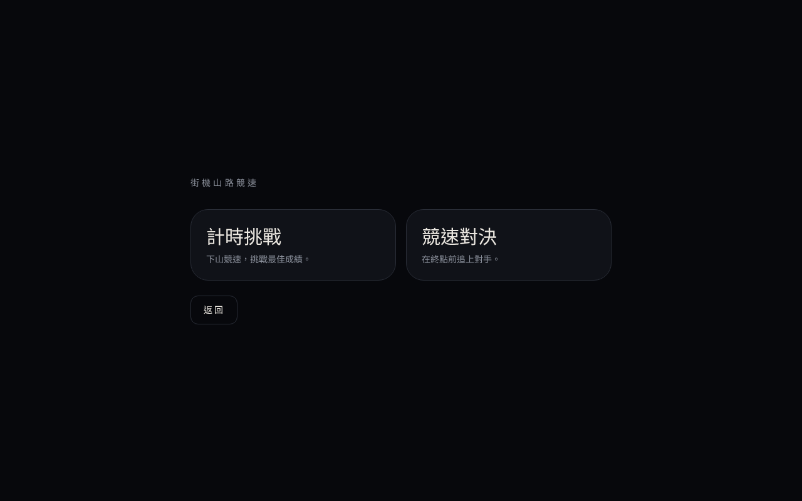
</p>

### Passes

<table>
  <tr>
    <td align="center" width="33%">
      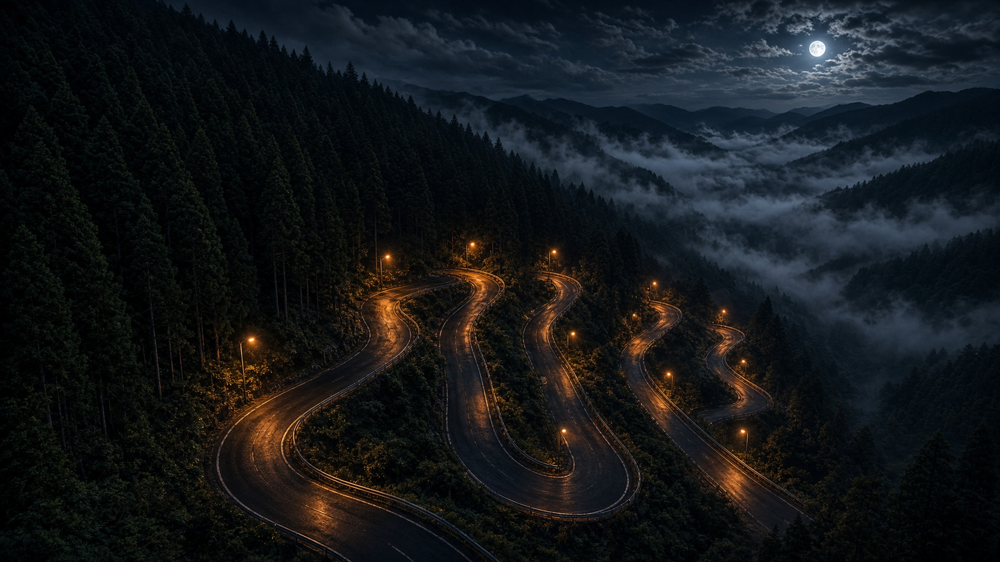<br>
      <b>KAMUI PASS</b> · 神居峠<br>
      <sub>Novice · 1.6 km · open hairpins</sub>
    </td>
    <td align="center" width="33%">
      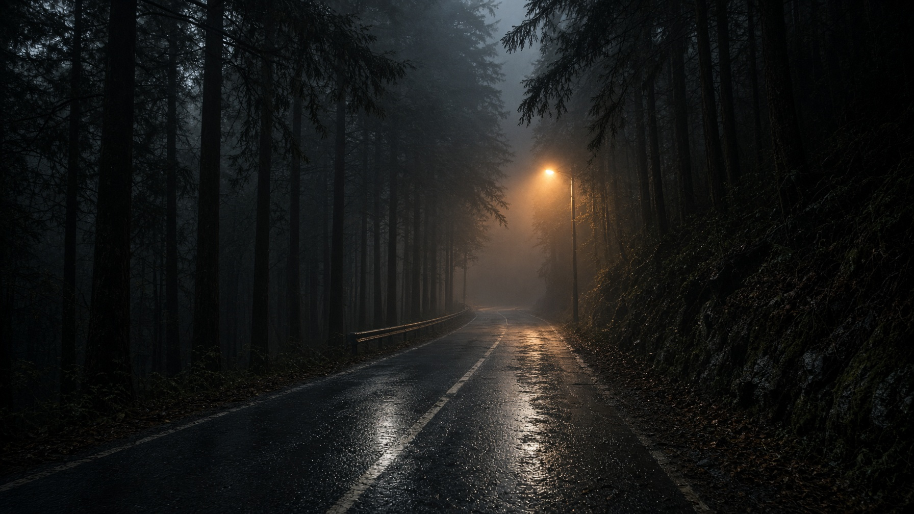<br>
      <b>AMAGIRI</b> · 雨霧峠<br>
      <sub>Intermediate · 1.8 km · fog, tight</sub>
    </td>
    <td align="center" width="33%">
      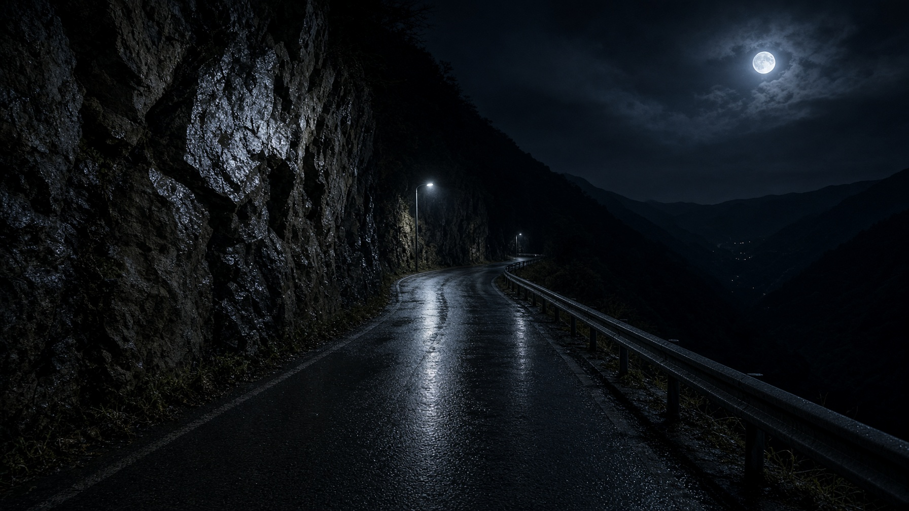<br>
      <b>KUZUREZAKA</b> · 崩坂<br>
      <sub>Expert · 2.1 km · cliffside</sub>
    </td>
  </tr>
</table>

### Cars

<table>
  <tr>
    <td align="center" width="25%">
      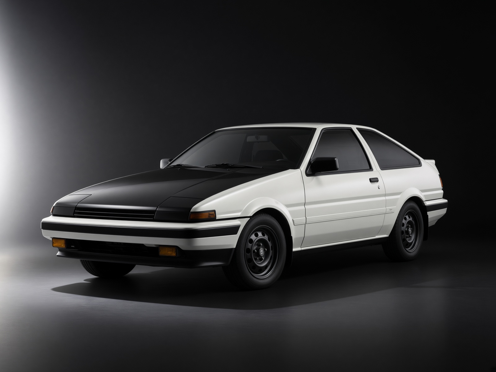<br>
      <b>KOMA 1600</b><br>
      <sub>FR LIGHT · 178 km/h<br>light, easy to drift</sub>
    </td>
    <td align="center" width="25%">
      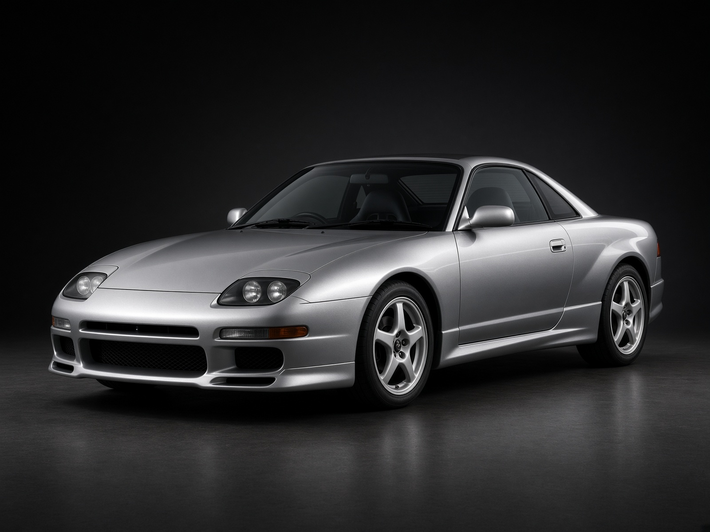<br>
      <b>RYSE TURBO</b><br>
      <sub>FR BALANCE · 212 km/h<br>all-rounder</sub>
    </td>
    <td align="center" width="25%">
      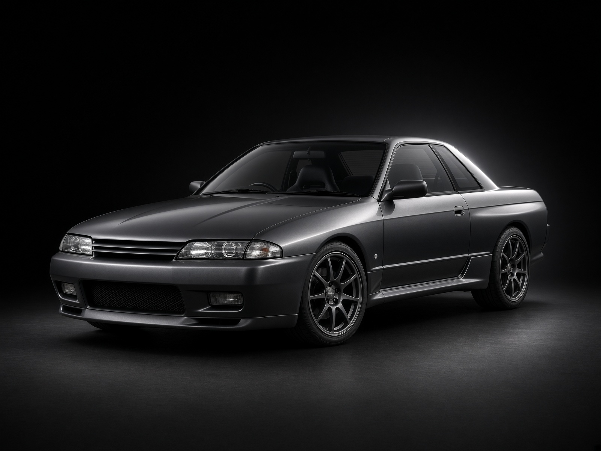<br>
      <b>KURO AWD</b><br>
      <sub>AWD GRIP · 228 km/h<br>planted, less slide</sub>
    </td>
    <td align="center" width="25%">
      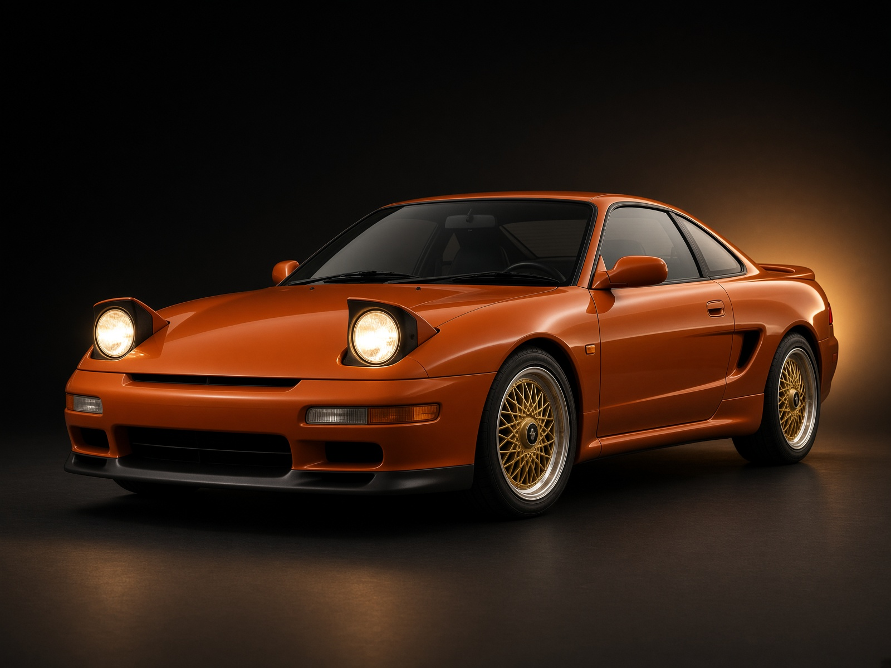<br>
      <b>ENREI ROTARY</b><br>
      <sub>FR PEAK · 232 km/h<br>fast, snappy rotary</sub>
    </td>
  </tr>
</table>

### Controls

| Action | Keyboard | Gamepad | Touch |
| --- | --- | --- | --- |
| Steer | `A` `D` / arrows | Left stick / d-pad | On-screen ◀ ▶ |
| Throttle | `W` / `↑` | RT | ACCEL |
| Brake | `S` / `↓` | LT | BRAKE |
| Drift | `Space` / `Shift` | A / X | DRIFT |
| Camera | `C` | — | — |
| Respawn | `R` | — | — |
| Pause | `Esc` / `P` | Start | Pause |

<p align="center">
  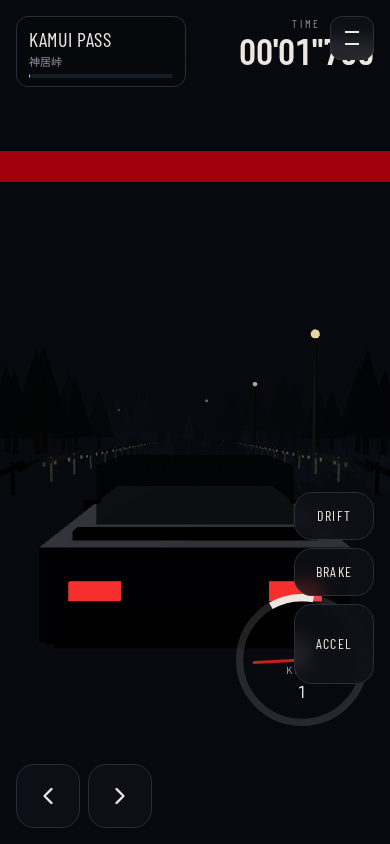
</p>

### Run locally

Needs **Node.js 22+**.

```bash
git clone https://github.com/<your-username>/touge-zero.git
cd touge-zero
npm install
npm run dev
```

Then open the URL Vite prints (typically `http://localhost:8080`).

```bash
npm run build     # production build
npm run preview   # serve the built output
```

No account. No server database. Best times live in `localStorage`.

### Stack

- **React 19** + **TanStack Start** + **Tailwind v4**
- **three.js** (WebGL) arcade car + spline mountain roads
- **Zustand** + `localStorage` for settings and records
- Web Audio engine note / tire screech (unlocks on first click)

---

## 中文

夜路、濕柏油、護欄、一輛輕量化後驅，一條想把你甩下山的峠。

**TOUGE ZERO** 是一款瀏覽器裡的街機山路競速：單向下山、計時挑戰、對手對決。向日本街機峠競速的手感致敬，但是原創作品。

### 怎麼玩

打開遊戲，按 **開始遊戲**，選模式、選峠、選車。

| 模式 | 說明 |
| --- | --- |
| **計時挑戰** | 獨自下山。打破自己的最佳成績。成績存在瀏覽器。 |
| **競速對決** | 對手先發。在終點前追上他。 |

標題畫面可切換 **中文 / English**。支援鍵盤、手把、手機觸控。

### 三條峠

| 峠 | 難度 | 長度 | 特色 |
| --- | --- | --- | --- |
| **神居峠** Kamui Pass | 入門 | 1.6 km | 開闊髮夾彎 |
| **雨霧峠** Amagiri | 進階 | 1.8 km | 濃霧、路窄 |
| **崩坂** Kuzurezaka | 專家 | 2.1 km | 斷崖單側護欄 |

### 四台車

| 車 | 驅動 | 極速 | 性格 |
| --- | --- | --- | --- |
| **KOMA 1600** | FR | 178 km/h | 輕、好漂 |
| **RYSE TURBO** | FR | 212 km/h | 均衡 |
| **KURO AWD** | AWD | 228 km/h | 抓地、不好甩 |
| **ENREI ROTARY** | FR | 232 km/h | 快、轉速兇 |

### 操作

| 操作 | 鍵盤 | 手把 | 觸控 |
| --- | --- | --- | --- |
| 轉向 | `A` `D` 或方向鍵 | 左搖桿 / 十字鍵 | 螢幕 ◀ ▶ |
| 油門 | `W` / `↑` | RT | 油門 |
| 煞車 | `S` / `↓` | LT | 煞車 |
| 漂移 | 空格或 `Shift` | A / X | 漂移 |
| 視角 / 重生 / 暫停 | `C` / `R` / `Esc` | Start 暫停 | 暫停鈕 |

### 本機執行

需要 **Node.js 22+**。

```bash
npm install
npm run dev
```

瀏覽器打開 Vite 印出的網址（通常是 `http://localhost:8080`）。成績存在瀏覽器本機，沒有帳號、沒有伺服器資料庫。

---

## License

[MIT](LICENSE)

Night-pass photographs in `public/art/` are generated artwork bundled with the game.
